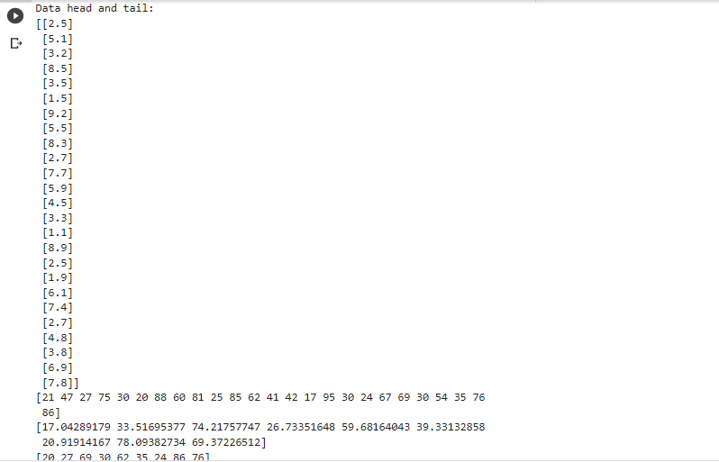
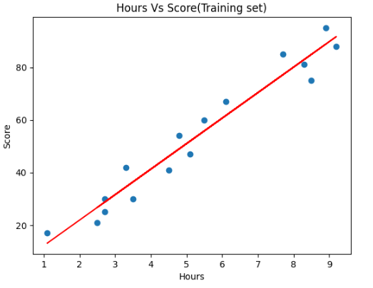
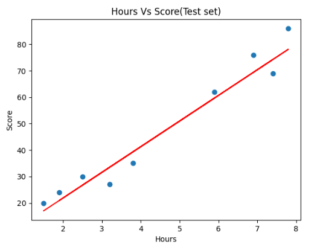
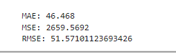

# Implementation-of-Simple-Linear-Regression-Model-for-Predicting-the-Marks-Scored

## AIM:
To write a program to predict the marks scored by a student using the simple linear regression model.

## Equipments Required:
1. Hardware – PCs
2. Anaconda – Python 3.7 Installation / Jupyter notebook

## Algorithm
1. Use the standard libraries in python.
2. Set variables for assigning dataset values.
3. Import LinearRegression from the sklearn.
4. Assign the points for representing the graph.
5. Predict the regression for marks by using the representation of the graph.
6. Compare the graphs and hence we obtain the LinearRegression for the given
data.

## Program:
```
/*
Program to implement the simple linear regression model for predicting the marks scored.
Developed by: Sowjanya S
RegisterNumber: 212220040158
*/
import numpy as np
import pandas as pd
import matplotlib.pyplot as plt

data=pd.read_csv('student_scores.csv')

print("Data head and tail:")
data.head()
data.tail()

x=data.iloc[:,:-1].values  
y=data.iloc[:,1].values


print(x)
print(y)

from sklearn.linear_model import LinearRegression
from sklearn.model_selection import train_test_split

x_train,x_test,y_train,y_test=train_test_split(x,y,test_size=1/3,random_state=0 )

regressor=LinearRegression() 
regressor.fit(x_train,y_train)

y_pred=regressor.predict(x_test) 
print(y_pred)

print(y_test)

#for train values
plt.scatter(x_train,y_train) 
plt.plot(x_train,regressor.predict(x_train),color='red') 
plt.title("Hours Vs Score(Training set)") 
plt.xlabel("Hours")
plt.ylabel("Score")
plt.show()

#for test values
y_pred=regressor.predict(x_test) 
plt.scatter(x_test,y_test) 
plt.plot(x_test,regressor.predict(x_test),color='red') 
plt.title("Hours Vs Score(Test set)") 
plt.xlabel("Hours")
plt.ylabel("Score")
plt.show()

import sklearn.metrics as metrics

mae = metrics.mean_absolute_error(x, y)
mse = metrics.mean_squared_error(x, y)
rmse = np.sqrt(mse)  

print("MAE:",mae)
print("MSE:", mse)
print("RMSE:", rmse)
```

## Output:






## Result:
Thus the program to implement the simple linear regression model for predicting the marks scored is written and verified using python programming.
